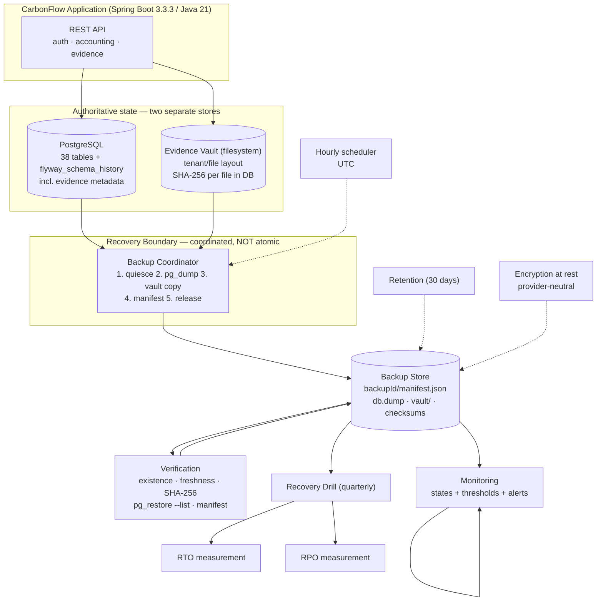

# CarbonFlow — Recovery Controls Architecture & Implementation Plan

> **Status: DESIGN ONLY. No recovery control is implemented.**
>
> This document **designs** the controls required by the project-level recovery
> requirements approved on 2026-10-01. It **does not implement** them, and it
> **does not claim compliance**.
>
> ```text
> APPROVED TARGET  ≠  IMPLEMENTED CONTROL  ≠  VALIDATED CONTROL
>                                              ≠  PRODUCTION-GRADE CONTROL
> ```
>
> As of this document: **RTO validation NOT YET TESTED**, **RPO validation NOT
> YET TESTED**, all required controls **NOT IMPLEMENTED**.
>
> Release state: `RELEASE CANDIDATE — FROZEN` at `d42af8b`. Documentation
> commits `b401a04` (approval) and `a8cee21` (consistency pass) precede this one.
> No application code, migration, schema or infrastructure was modified.

---

## 1. Purpose

CarbonFlow has approved project-level recovery requirements but no mechanism
that satisfies them. Backups are manual and on demand, so the actual recovery
point is unbounded and the actual recovery time depends entirely on a human
noticing a problem.

This document converts those targets into a concrete, buildable architecture
that can be implemented and **demonstrated locally**, without paid cloud
infrastructure, Kubernetes, a SIEM, or a 24/7 operations department. Its
purpose is to make the gap between *approved* and *implemented* explicit and
closable, one control at a time.

The design is deliberately boring: PostgreSQL's own logical backup tooling, a
directory copy for the vault, a small verification utility, and plain files on
disk. Every mechanism is chosen because it can be **shown working in this
repository**, not because it appears enterprise-grade.

---

## 2. Current approved requirements

Authoritative source: `docs/OPERATIONAL-RECOVERY-REQUIREMENTS.md` (§2, §10).

| Requirement | Approved value | Approved | Implemented | Validated |
| --- | --- | --- | --- | --- |
| RTO | 4 hours | 2026-10-01 | **NOT IMPLEMENTED** | **NOT YET TESTED** |
| RPO | 1 hour | 2026-10-01 | **NOT IMPLEMENTED** | **NOT YET TESTED** |
| Backup frequency | ≥ once per hour, DB + vault | 2026-10-01 | **NOT IMPLEMENTED** | **NOT YET TESTED** |
| Retention | 30 days, DB + vault | 2026-10-01 | **NOT IMPLEMENTED** | **NOT YET TESTED** |
| Recovery boundary | DB + vault consistent | 2026-10-01 | **NOT IMPLEMENTED** | **NOT YET TESTED** |
| Monitoring | automated, with alerting | 2026-10-01 | **NOT IMPLEMENTED** | **NOT YET TESTED** |
| Restore drill | quarterly | 2026-10-01 | **NOT SCHEDULED** | 1 drill 2026-09-30 |

**Classification: PROJECT-LEVEL REQUIREMENT — NOT A CONTRACTUAL SLA.**

Additional approved decisions that constrain the design:

- **The evidence vault carries the same RTO and RPO as the database.** A
  database-only restore is **not** a complete recovery.
- RTO scope — usable means: authentication works, application operational,
  database available, evidence vault available, core existing data accessible.
- Qualifying failure — requires restoration of infrastructure/database/vault
  state. Not individual upload failures, user errors, or ordinary
  application-level incidents.
- Owner: CarbonFlow Project Owner / CarbonFlow Operations.

---

## 3. Current implementation state (inspected, not assumed)

Everything below was read from the repository during this design phase.

### 3.1 Repository structure (actual)

```text
backend-java/            Spring Boot 3.3.3, Java 21, plain JDBC (ADR-009, no ORM)
  src/main/resources/application.properties
  src/main/java/com/carbonflow/{config,controller,service,repository,model,security}
  src/test/java/com/carbonflow/{...,testsupport}
db/migration/            Flyway V1..V8 (NOT V9 — V9 would be a migration change)
src/                     React/TypeScript frontend
docs/                    operational documentation
vault_storage/           evidence vault default location (git-ignored)
```

> The task brief referred to `backend/` and `frontend/`. **Neither exists.** The
> real paths are `backend-java/` and `src/`. This design uses the real paths.

### 3.2 Database

| Property | Observed value | Source |
| --- | --- | --- |
| Engine | PostgreSQL (JDBC driver `org.postgresql`) | `backend-java/pom.xml` |
| Access | Plain JDBC + HikariCP, pool size 10 | `application.properties` |
| Migrations | Flyway **V1–V8**, `baseline-on-migrate=true`, `baseline-version=6`, `validate-on-migrate=true` | `application.properties` |
| Schema history | `flyway_schema_history` carries checksums | `db/migration/V1` |
| TLS | `DB_SSLMODE`, fail-closed via `DataSourceTls` (F-01) | `DataSourceTlsTest` |
| Vault coupling | `carbonflow.evidence.vault-dir=${CARBONFLOW_EVIDENCE_VAULT_DIR:vault_storage}` | `application.properties` |
| Upload limits | 25 MB per file, 28 MB request ceiling | `application.properties` |

`flyway_schema_history` **must** be included in every backup. A restore without
it causes Flyway to baseline at 6 and silently skip validation of V1–V6
(`docs/BACKUP-RECOVERY.md` §5).

### 3.3 Evidence Vault — findings that drive the design

Read from `EvidenceStorageService.java` and `db/migration/V1`:

1. **Files live on the filesystem, not in PostgreSQL.** Metadata
   (`evidence_records`, `evidence_versions`, `evidence_links`) is in the
   database; bytes are on disk.
2. **Layout is `<vaultDir>/<organizationId>/<millis>_<uuid8>_<originalName>`**,
   one directory per tenant.
3. **A per-file SHA-256 is already stored in the database**
   (`evidence_records.sha256_hash`, `evidence_versions.sha256_hash`, 64 hex
   chars). **This is the single most valuable fact in this design** — it gives
   per-file integrity verification for free, with no new schema and no new
   application code.
4. **`storage_path` is an ABSOLUTE path** (`target.toString()`), and
   `file_size_bytes` is stored alongside. Restoring the vault to a different
   directory than the original therefore leaves every `storage_path` dangling.
   → **The restore target MUST match the original vault path, or paths must be
   rewritten.** This is a real recovery constraint, addressed in §7.4.
5. **`Files.write(target, content)` writes directly to the final path.** There
   is no write-to-temp-then-atomic-rename. A backup copying concurrently with an
   upload can therefore observe a **partially written file**. This is the
   central consistency problem, addressed in §5.
6. **No versioning-on-write.** A file is written once; `evidence_versions`
   exists for logical versions, not filesystem snapshots.
7. **Containment is enforced** on read via `isPathInside(baseDir, resolved)`.
   A restored vault is only readable if it sits at the configured vault path.
8. Deletion exists (`deleteFile`) and is not audited by the storage layer —
   it is governed by the application and DB cascade.

### 3.4 Security controls in place

- Secrets only via environment variables: `DB_PASSWORD`,
  `CARBONFLOW_JWT_SECRET`, `CARBONFLOW_REFRESH_TOKEN_SECRET`. `.env` is
  git-ignored (`.env*`, `!.env.example`); no plaintext secret is committed.
- `vault_storage/` is git-ignored.
- Authorization is server-side (`@PreAuthorize`, 9 roles × 44 permissions);
  evidence access is tenant-scoped.
- **Encryption at rest for backups: NOT IMPLEMENTED.** No KMS, no key
  management, no provider SDK in `pom.xml`.

### 3.5 Existing operational tooling

**None.** There is no `scripts/`, `ops/`, `infra/`, or `tools/` directory in the
repository, no Dockerfile, no compose file, no CI (`.github/` does not exist).
Every operational step in `docs/BACKUP-RECOVERY.md` is executed by hand.

**One genuinely useful asset:** `backend-java/src/test/java/com/carbonflow/testsupport/`
provides `EmbeddedPg` — a **real PostgreSQL server** started from bundled
binaries, used by `PostgresBackedIntegrationTest`. This is the natural home for
automated backup/restore verification tests: real PostgreSQL, no Docker, no
external service.

---

## 4. Architecture



**Atomicity is explicitly NOT claimed.** PostgreSQL and the filesystem share no
transaction coordinator. The recovery boundary is a **coordinated, ordered
snapshot** built under quiesce (§5), not an atomic two-phase commit.

---

## 5. Recovery boundary

> **Question A: how is a consistent recovery point established containing
> PostgreSQL state + vault bytes + evidence metadata?**

### 5.1 The problem

`pg_dump` is transactionally consistent on its own. A filesystem copy is not.
`EvidenceStorageService` writes bytes **directly to the final path** (§3.3.5), so
a copy taken during an upload can capture a truncated file. Worse, the
database may already have committed the `evidence_records` row that references
bytes that were never fully written.

`docs/BACKUP-RECOVERY.md` §2.5 already states the rule:

> *"Never restore a database newer than the vault."*

### 5.2 Chosen strategy — quiesced coordinated snapshot

The vault is small and the application is a single instance, so the simplest
correct approach is to **quiesce the application** during the vault copy. This
is the same technique already rehearsed on 2026-09-30 and recorded in
`docs/OPERATIONAL-VALIDATION.md` ("taken with the application quiesced").

Ordered sequence, all timestamps **UTC**:

```text
T0  Quiesce            Stop the application (or enable maintenance mode).
                        No new uploads, no DB writes from the app.
T1  DB snapshot        pg_dump --format=custom   (transactionally consistent)
T2  Vault snapshot     copy vault tree -> vault/  (safe: no concurrent writes)
T3  Checksums          SHA-256 over db.dump and every vault file
T4  Manifest           write manifest.json binding T1+T2+T3
T5  Release            Restart the application
```

**Ordering guarantee:** the database snapshot at `T1` reflects all writes
committed before `T0`; the vault snapshot at `T2` is complete because nothing
could be written during `[T0, T2]`. Therefore:

```text
vault content ⊇ database-referenced evidence content     (safe direction)
```

This is exactly the ordering §2.5 requires. The unsafe case — a database newer
than the vault, referencing bytes that were never captured — **cannot occur**,
because the vault copy is strictly later than the quiesce point and no writes
happen in between.

### 5.3 What this does NOT guarantee

- **Not atomic.** A crash mid-sequence leaves an incomplete backup set. Handled
  by §8: the manifest is written **last**, so a set without a manifest is
  `UNVERIFIABLE` and is never eligible for restore.
- **Not zero-data-loss for in-flight uploads.** An upload interrupted at `T0`
  fails cleanly (the row is not committed), so it is lost — but it was never
  committed data. An RPO test must use **committed** data only (§16).
- **Not a substitute for WAL/PITR.** RPO is bounded by the backup interval
  (§6.4), not by a continuous archive.
- **Quiesce is a real availability cost.** For an hour-long business-hours
  platform, a sub-minute maintenance window hourly is acceptable; for a genuine
  24×7 service it would not be, and an application-level write barrier or
  storage-level snapshot would be required instead. Recorded as a production
  limitation (§20).

### 5.4 Recovery boundary timestamp

The boundary is **`T_boundary = T1` (the DB snapshot instant)**, recorded to
second precision in the manifest as `recovery_boundary_utc`.

The vault copy at `T2` is *later*, so the vault is a superset. The boundary is
therefore defined by the **earlier** of the two — the conservative choice, since
anything not in the DB snapshot is not committed data.

---

## 6. Database backup strategy

> **Question B: `pg_dump`, physical backup, WAL/PITR, or scheduled logical?**

### 6.1 Options evaluated

| Option | Suitability for CarbonFlow | Verdict |
| --- | --- | --- |
| **`pg_dump` logical, custom format** | Portable across PG major versions; already the documented procedure; exercised in the 2026-09-30 drill; ~1.6 s on the drill dataset; no server-side config needed | **SELECTED** |
| `pg_dumpall --globals-only` | Roles/`permissions`/`role_permissions` live **outside** the database dump but are read at runtime. **Mandatory companion** to `pg_dump` | **SELECTED as companion** |
| `pg_basebackup` physical | Faster for large databases; **requires exact same PG major version** on restore; doubles storage; no benefit at project scale | Rejected for now |
| WAL archiving / PITR | Would allow sub-hour RPO; depends on server-side config **outside this repo**; adds continuous-archiving operational burden | **Not required** by a 1-hour RPO (§6.4). Reconsider if RPO tightens |

### 6.2 Selected approach

A **scheduled logical backup** of the database plus a companion globals capture:

```bash
pg_dump --format=custom --compress=9 --file=<set>/db.dump
pg_dumpall --globals-only --file=<set>/globals.sql
psql -t -A -c "select version, description, success
                from flyway_schema_history order by installed_rank"
```

The Flyway query output is stored in the manifest so a restore can be reasoned
about without re-inspecting the server.

**Why it is suitable:** it needs no server-side configuration change, it is
already the documented and rehearsed procedure, it is human-inspectable, and it
restores cleanly onto the `embedded-postgres` binaries already in the test
harness — which is what makes automated verification feasible in this repo.

**Limitations:** restore time scales with dataset size; no point-in-time
granularity between dumps; large objects would be inlined (not currently used).

### 6.3 Expected recovery behaviour

From the 2026-09-30 drill: `createdb` 1.42 s, `pg_restore` 2.04 s, vault
restore 0.06 s, application restart 22.9 s, total 66.4 s to health and 177.9 s
to verified usability — **on a 115 KB synthetic dataset over loopback**. At
realistic dataset sizes `pg_restore` and JVM startup trade places as the
dominant cost. **These are observations, not predictions, and not an RTO.**

### 6.4 Interaction with the 1-hour RPO

An hourly schedule bounds loss to **≤ 1 hour** by construction. Two honest
caveats:

1. **No margin.** A backup at the maximum permitted interval gives worst-case
   loss approaching exactly 1 hour. The approved RPO therefore leaves no slack.
   Flagged in `docs/OPERATIONAL-RECOVERY-REQUIREMENTS.md` §12.1; not changed
   here — tightening is a business decision.
2. **WAL/PITR is not required** to meet an hourly RPO, so the design does not
   mandate it. PITR would be the mechanism to *guarantee* the boundary exactly
   and to reduce the interval; it is deferred, not dismissed.

---

## 7. Evidence Vault backup strategy

> **Question C: how does the vault meet the same requirement as the database?**

### 7.1 Backup method

Filesystem copy under quiesce (§5.2). Platform-appropriate: `robocopy /MIR`
on Windows, `rsync -a --delete --exclude '*.tmp'` on POSIX — both excluding
in-flight `*.tmp` files. **The documented `rsync` command remains
`DOCUMENTED BUT NOT TESTED`** (the 2026-09-30 drill host had no `rsync`); this is
a recorded deviation to close in REC-10, not to paper over.

### 7.2 Snapshot and checksum strategy

- One directory per backup set: `<backupSet>/vault/`, mirroring the tenant
  layout.
- Per-file SHA-256 computed at copy time and written to a vault index in the
  manifest.

### 7.3 The decisive verification insight

The database **already stores a SHA-256 for every evidence file**
(`evidence_records.sha256_hash`, §3.3.3). This means vault integrity can be
verified against an **independent source** — the database — rather than only
against the copy itself:

```text
For each evidence row in the restored DB:
    locate file at storage_path
    compute SHA-256 of restored bytes
    compare with evidence_records.sha256_hash from the SAME backup set
    compare with file size against file_size_bytes
```

This is exactly the check that already passed in the 2026-09-30 drill (restored
file SHA-256 identical at four independent points). It requires **no schema
change, no migration, and no application code change** — only a script.

It also catches the torn-file case in §3.3.5: a file captured mid-write will
not match its recorded hash, and the backup set is marked `UNVERIFIABLE`
rather than silently restored as damaged data.

### 7.4 Restore procedure and the absolute-path constraint

`storage_path` is absolute (§3.3.4) and containment is enforced against the
configured vault dir. Two supported modes:

- **Preferred — same path:** restore the vault to the original
  `CARBONFLOW_EVIDENCE_VAULT_DIR`. All `storage_path` values resolve unchanged.
- **Fallback — path rewrite:** restore elsewhere, then `UPDATE
  evidence_records/evidence_versions SET storage_path = ...` with the new prefix
  **inside the transaction that the restore itself is verified against**. This is
  a data rewrite, so it must be recorded in the drill evidence.

Prefer the first. The design's local demonstration restores to the same path,
which sidesteps the rewrite entirely.

**Restore ordering (mandatory, per §2.5):** database first, then vault from the
same or later timestamp. Never a database newer than the vault.

---

## 8. Recovery manifest

> **Question D: should CarbonFlow introduce a recovery manifest? — YES.**

A manifest is the single object that makes the recovery boundary, integrity and
verification state explicit and machine-checkable. Without it, "was this backup
complete and consistent?" is answerable only by human inspection.

**Decision: introduce a manifest.** It is the minimum viable artifact that lets
verification, retention, monitoring and the drill all reason about the same set.

Written **last** (after DB dump, vault copy and checksums), so its presence
proves the set is complete.

```jsonc
{
  "manifest_version": 1,
  "backup_id":        "2026-10-01T14:00:00Z",   // set identifier == slot
  "started_utc":      "2026-10-01T14:00:00Z",
  "completed_utc":    "2026-10-01T14:00:12Z",

  // The boundary. Conservative: earlier of DB snapshot and vault copy.
  "recovery_boundary_utc": "2026-10-01T14:00:03Z",

  "database": {
    "dump_file":    "db.dump",
    "dump_sha256":  "<hex>",
    "dump_bytes":   123456,
    "globals_file": "globals.sql",
    "flyway_versions": ["V1","V2","V3","V4","V5","V6","V7","V8"],
    "flyway_all_success": true
  },

  "evidence_vault": {
    "dir": "vault",
    "file_count": 12,
    "total_bytes": 456789,
    "index_file": "vault-index.tsv",   // <relpath>\t<sha256>\t<bytes>
    "copied_with": "robocopy"          // or rsync — records the deviation
  },

  "application": {
    "artifact":   "carbonflow-backend-1.0.0-PRO.jar",
    "version":    "1.0.0-PRO",
    "frozen_release": "d42af8b"
  },

  "verification": {
    "status": "UNVERIFIED",            // UNVERIFIED | VERIFIED | UNVERIFIABLE
    "checked_utc": null,
    "checks": { "dump_listable": null, "manifest_hash_match": null,
                "vault_files_present": null, "cross_store_hash_match": null },
    "reason": null                     // populated when UNVERIFIABLE
  }
}
```

Design notes:

- **Provider-neutral and platform-neutral.** No cloud SDK, no absolute paths
  that would break portability.
- `verification.status` is **written by the verifier, not the backup job**, so a
  backup can never mark itself verified.
- `copied_with` preserves the `rsync`/`robocopy` deviation honestly instead of
  hiding it.
- No secrets are ever recorded here — **not** `DB_PASSWORD`, not the JWT
  secrets. Those live in the secret manager and must be re-supplied at restore
  time (`docs/BACKUP-RECOVERY.md` §4 Step 6).

---

## 9. Scheduling

> **Question E: how is the hourly schedule built?**

| Aspect | Design |
| --- | --- |
| Frequency | Hourly, aligned to **UTC** hour boundaries (`T0` at `:00`) |
| Timezone | **UTC only.** No geographic or local timezone is hardcoded. `TZ` never influences the slot; all timestamps in the manifest are UTC ISO-8601 with `Z` |
| Overlap prevention | Exclusive lock file in the backup store (`<backupId>.lock`). A run that cannot acquire it exits immediately as `SKIPPED_OVERLAPPING`, never queued |
| Duration guard | If a run exceeds 45 min (75% of the slot), it is flagged `OVERRUN` — an RPO breach is in progress |
| Failure handling | Non-zero exit → `FAILED`; the partial set is moved to `failed/` and never treated as a candidate set |
| Retry | One retry after 60 s for **transient** errors only (connection reset, lock timeout). **No retry** for deterministic errors (bad credentials, missing vault dir) — retrying cannot fix them and hides the fault |
| Missed slot | A missing hour is detectable by absence of a manifest for that slot; monitoring alerts (§12) |
| Boundary identification | Slot start `T0` is the boundary anchor; `recovery_boundary_utc` is written from the actual `pg_dump` start (§5.4) |

**Local demonstration** — no cron required, no root, no service manager:

- A long-running supervisor loop for a demo window, **or**
- one-shot invocations on demand, **or**
- the platform scheduler (Task Scheduler / cron) in an operator environment.

All three execute the **same** script, so the demonstrable behaviour is
identical to the schedulable one.

---

## 10. Retention

> **Question F: how is 30 days enforced?**

| Aspect | Design |
| --- | --- |
| Rule | Delete backup sets whose `completed_utc` is older than **30 days** |
| Scope | Database **and** evidence-vault backups — the vault has the same retention, per the approval |
| Granularity | Whole backup set (manifest + `db.dump` + `globals.sql` + `vault/`). Never partial: deleting a dump while keeping its manifest would leave an unrestorable set |
| Deletion safety | **Two-pass, oldest-first.** Pass 1 lists candidates and records them. Pass 2 deletes only sets that (a) have a manifest, (b) are older than 30 days, (c) are **not** the newest verified set, and (d) are not currently locked by a running backup or drill |
| Last-resort guard | Never delete the **newest VERIFIED** set regardless of age. Prevents a misconfigured clock or an empty verification result from destroying all backups |
| Clock guard | If the system clock moves backwards, retention **refuses to delete** and alerts instead. A backwards clock must never trigger mass deletion |
| Dependency chains | None in this design. Logical dumps are **self-contained** — there is no incremental chain and no full-base backup dependency. This is a direct benefit of choosing `pg_dump` over physical/PITR |
| Audit | Every deletion is logged (set id, boundary, age, actor). Backups contain every tenant's data; deletion is a governed act |

**Local demonstration:** point the retention root at a scratch directory,
create sets with back-dated `completed_utc` values spanning 0/29/31/40/400
days, run retention, and assert that 31/40/400-day sets were removed while the
0-day and 29-day sets survived and the newest verified set survived regardless.
Fully deterministic, no waiting required.

**Regulatory caveat (unchanged):** `docs/BACKUP-RECOVERY.md` §3.1 notes a
possible **7-year** baseline for GHG inventory data. The approved retention is
**30 days**. The 7-year question is **unresolved** and requires legal input.
This design implements 30 days as approved and does not assume the regulatory
figure.

---

## 11. Verification

> **Question G: what makes a backup UNVERIFIABLE, and what is checked?**

### 11.1 Automated checks

| Check | Method | Failure ⇒ |
| --- | --- | --- |
| Set exists | Manifest present and parses | `UNVERIFIABLE` |
| Manifest self-consistency | Referenced files all present; sizes match | `UNVERIFIABLE` |
| DB dump integrity | SHA-256 of `db.dump` matches manifest | `UNVERIFIABLE` |
| DB dump readable | `pg_restore --list db.dump` exits 0 (structure readable **without restoring**) | `UNVERIFIABLE` |
| Vault index integrity | Per-file SHA-256 recomputed, matches index | `UNVERIFIABLE` |
| Cross-store hash match | Restored-DB `sha256_hash` vs restored file bytes | `UNVERIFIABLE` |
| Freshness | `completed_utc` within the staleness window | `STALE` (not unverifiable) |
| Boundary ordering | `recovery_boundary_utc` ≤ vault copy time | `UNVERIFIABLE` |

`pg_restore --list` is the key cheap check: it validates the archive structure
**without restoring it**, so daily verification does not require a scratch
database. Full cross-store validation requires a scratch database and is
therefore performed by the drill (§14), not every hour.

### 11.2 Definition of UNVERIFIABLE

A backup set is **UNVERIFIABLE** when its integrity cannot be established —
specifically:

```text
manifest missing, unparseable, or version-unsupported
referenced artefact missing or size mismatch
recorded checksum != recomputed checksum
pg_restore --list fails
vault file missing relative to the vault index
restored evidence bytes do not match evidence_records.sha256_hash
boundary ordering violated
verification could not run at all (e.g. PostgreSQL unreachable)
```

**UNVERIFIABLE is treated as a failure, not as a warning.** An unverified
backup is **never** eligible for a restore or for satisfying the RPO.

### 11.3 Local demonstration

The verifier runs against the `embedded-postgres` instance from
`backend-java/src/test/.../testsupport/EmbeddedPg.java`. No Docker, no external
service. Corruption is induced deliberately (flip a byte, delete a file,
truncate the manifest) to prove each check **fails** as specified — a verifier
that has never been seen to fail has not been tested.

---

## 12. Monitoring

> **Question H: minimum useful monitoring model.**

Thresholds derive from the approved **1-hour RPO** and the **hourly** schedule.
They are **targets for alerting**, not evidence of compliance.

### 12.1 States and thresholds

| State | Condition | Threshold | Severity |
| --- | --- | --- | --- |
| `BACKUP_STARTED` | Slot begins | on event | info |
| `BACKUP_SUCCEEDED` | Manifest written | on event | info |
| `BACKUP_FAILED` | Non-zero exit | on event | **critical** |
| `BACKUP_MISSING` | No manifest for a completed slot | > 1 missed slot (**~2 h**) | **critical** |
| `BACKUP_STALE` | Newest set older than the RPO window | **> 1 h** since `completed_utc` | **critical** |
| `BACKUP_OVERRUN` | Run exceeds 45 min | on detection | warning |
| `BACKUP_UNVERIFIABLE` | §11.2 condition | on detection | **critical** |
| `VAULT_BACKUP_MISSING` | Vault index absent for a set | on detection | **critical** |
| `VAULT_HASH_MISMATCH` | Restored bytes ≠ recorded SHA-256 | on detection | **critical** |
| `DB_BACKUP_MISSING` | `db.dump` absent from a set | on detection | **critical** |
| `RECOVERY_BOUNDARY_MISMATCH` | Boundary ordering violated | on detection | **critical** |
| `RETENTION_FAILURE` | Retention refused or errored | on detection | warning |
| `RPO_AT_RISK` | `now − completed_utc` > 45 min (75% of window) | **> 45 min** | warning |

`STALE` at >1 h is deliberately aligned with the RPO: a backup older than the
approved data-loss window means the RPO **can no longer be met**, whether or not
a failure occurs. `RPO_AT_RISK` gives 15 minutes of warning before that.

### 12.2 Implementation shape

A **file-based status document** (`monitoring/latest-status.json`) plus
console/stdout events, with an **alert sink interface** that is intentionally
minimal and provider-neutral. Escalation routing is a business concern
(`docs/OPERATIONAL-RECOVERY-REQUIREMENTS.md` §2.1): the monitor raises a
state; **CarbonFlow Operations** decides who acts.

> **Honest limitation:** a monitor that only writes a file cannot wake a human at
> 3 a.m. It detects; it does not *reach*. A real alerting channel is a
> deployment decision outside this repository. This is why on-call responsibility
> and the escalation path are business requirements rather than code.

### 12.3 Detection is a prerequisite for the RTO

The approved RTO clock **starts at the qualifying failure**, not at detection.
With no monitoring, an outage may consume hours before anyone starts. This is
**GAP-01** in `docs/OPERATIONAL-RECOVERY-REQUIREMENTS.md` §12 and the single
highest-priority control.

---

## 13. Encryption at rest

> **Question I: encryption design — provider-neutral, no invented cloud.**

| Element | Design |
| --- | --- |
| DB backup | Encrypt `db.dump` and `globals.sql` after dump, before publication |
| Vault backup | Encrypt the vault payload; per-file checksums are computed **before** encryption, over plaintext, so verification still works |
| Algorithm | **age** (X25519 + ChaCha20-Poly1305) or **age + symmetric passphrase**; `gpg --symmetric --cipher-algo AES256` is the already-documented fallback (`docs/BACKUP-RECOVERY.md` §3.2) |
| Key storage | **Asymmetric** encryption with an offline public key for backup writes, private key held by the operator/secret manager. The backup job never holds the private key |
| Why asymmetric | Multiple operators and automated jobs can write backups without being able to decrypt them — least privilege by construction |
| Rotation | Public key per backup set recorded in the manifest (`recipient_id`); rotate by publishing a new public key. Old sets remain decryptable with their recorded key |
| Restore-time decryption | Private key is supplied out-of-band; decrypt to a temp path, verify checksums, then restore. Decrypted plaintext must never be written to the backup store |
| Secrets exclusion | **`DB_PASSWORD`, `CARBONFLOW_JWT_SECRET`, `CARBONFLOW_REFRESH_TOKEN_SECRET` are never in a backup** (`docs/BACKUP-RECOVERY.md` §1.3). A backup containing secrets must be handled as a secret store, not a data archive |
| Transport | TLS when copying to any remote store (`docs/BACKUP-RECOVERY.md` §3.2) |

**No cloud provider is assumed.** No KMS SDK, no provider-specific API. `age`
and `gpg` are ordinary local tools; a future deployment can substitute a managed
key service without changing the backup format.

---

## 14. Recovery drill

> **Question J: the repeatable quarterly drill.**

### 14.1 Procedure

```text
1.  backup discovery        locate newest VERIFIED set
2.  backup verification     re-run verification; abort if UNVERIFIABLE
3.  database restoration    createdb + pg_restore + globals
4.  vault restoration       copy vault to the ORIGINAL vault path (§7.4)
5.  recovery-boundary check boundary ordering + manifest consistency
6.  application startup     start jar against restored DB; confirm Flyway
                            validates 8 migrations and applies none
7.  authentication          login 200; wrong password 401; deactivated org 403
8.  existing data access    activity, calculation, emission, audit, inventory
9.  evidence retrieval      download a known evidence record
10. SHA-256 verification    restored bytes == recorded sha256_hash
11. tenant isolation        tenant A sees only A; tenant B id → 403/404
12. measured elapsed time   record timings (§15)
13. findings                documented; drill fails if any check fails
```

Step 6 is decisive: the log must show **"No migration necessary."** Migrations
being applied would mean the dump and migration files disagree.

Step 11 is the most important post-restore check — a restore that mixed tenant
data would be a serious data-integrity incident.

### 14.2 Evidence recorded per drill

Identical to the approved evidence set: database restore result; evidence-vault
restore result; checksum/integrity verification; application retrieval
verification; tenant-isolation verification; observed recovery duration;
documented findings.

Plus: `recovery_boundary_utc`, the RPO measurement (§16), and the environment
(dataset size, PG version, cold/warm JVM) — because a recovery number without
its conditions is not evidence of anything.

---

## 15. RTO measurement

> The approved RTO is **4 hours**. The 2026-09-30 drill's 177.9 s is **not** an
> RTO and must never be described as one.

### 15.1 Clock definition

| | Definition |
| --- | --- |
| **START** | The moment a qualifying failure is **declared**, recorded as a timestamp by the drill harness with UTC precision. Qualifying = requires restoration of infrastructure/DB/vault state. An individual upload failure or user error is **not** a qualifying failure and must not be used to start the clock |
| **STOP** | The moment **all** §2 usable-state conditions are verified: authentication working; application operational; database available; evidence vault available; core existing data accessible; evidence retrieval working |

**STOP is not "health is UP."** The 2026-09-30 drill deliberately distinguished
66.4 s (health UP) from 177.9 s (verified usable). That distinction is
preserved: the RTO stops at *verified usable*, not at *process started*.

### 15.2 Reproducible capture

The drill harness writes machine-readable timing events, not prose:

```jsonc
{ "rto_run": "2026-10-01T00:00:00Z",
  "events": [
    {"at":"…T00:00:00Z","phase":"FAILURE_DECLARED"},
    {"at":"…T00:00:12Z","phase":"DETECTED"},
    {"at":"…T00:00:45Z","phase":"DB_RESTORED"},
    {"at":"…T00:01:02Z","phase":"VAULT_RESTORED"},
    {"at":"…T00:01:30Z","phase":"APP_OPERATIONAL"},
    {"at":"…T00:02:10Z","phase":"AUTH_OK"},
    {"at":"…T00:02:55Z","phase":"DATA_ACCESSIBLE"},
    {"at":"…T00:02:58Z","phase":"EVIDENCE_RETRIEVED"},
    {"at":"…T00:02:58Z","phase":"USABLE_STATE_VERIFIED"}
  ],
  "elapsed_to_usable_seconds": 178,
  "rto_budget_seconds": 14400,
  "environment": { "dataset_bytes": 115047, "pg_version": "18.6",
                   "network": "loopback", "ha": false },
  "result": "WITHIN_TARGET" }
```

The environment block is mandatory. A recovery time measured on a synthetic
115 KB dataset over loopback **cannot** support a production RTO claim, and the
record must make that visible rather than hide it.

### 15.3 What a pass means, and what it does not

Even a within-budget result establishes only that **the procedure completed
within 4 hours under the recorded conditions**. It does **not** establish
production readiness, because detection was performed by a human in the loop.
A production RTO claim additionally requires automated detection (§12).

---

## 16. RPO measurement

> The approved RPO is **1 hour**. **Restore duration is not RPO.** RPO is about
> how much *committed data* can be lost.

### 16.1 The test

```text
T0  Record the recovery boundary B of the set under test (recovery_boundary_utc)
T1  Write a COMMITTED, uniquely identifiable marker into the database
      - e.g. an activity_data row with a distinctive identifier
T2  Wait until the next scheduled backup runs, capturing new boundary B'
T3  Destroy the database and the vault  (simulating a qualifying failure)
T4  Restore the set at boundary B'
T5  Verify precisely which markers survive
```

### 16.2 Measurement

```text
RPO_actual = failure_time( T3 ) − B'

Then assert the two properties separately:
  COMMITTED-LOSS  = markers committed in (B', T3] that are absent after restore
                    MUST be 0 relative to the approved RPO
  PREDICTED-LOSS  = if a failure occurs just before the next backup, loss is
                    bounded by the slot interval (~1 h)
```

A marker written **after** `B'` and before `T3` **should** be lost — that is the
correct behaviour, and losing it is not a failure. What must be asserted is that
it was lost **because** it fell outside the boundary, and that **no** marker
committed at or before `B'` was lost.

### 16.3 Why this cannot be faked

The 2026-09-30 drill already demonstrated the boundary is **exact** — data
written before the backup survived, data written after it was correctly lost.
What it could **not** demonstrate was RPO compliance, because the backup was
operator-timed. REC-11 replaces operator timing with a scheduler; only then is
the RPO evidence meaningful.

**RPO validation remains NOT YET TESTED until that test runs against a
scheduled backup.**

---

## 17. Implementation phases

No tracker is created — none exists in this repository, and the task brief
requires not inventing one.

| ID | Objective | Likely files | Depends on | Acceptance |
| --- | --- | --- | --- | --- |
| **REC-01** | Recovery architecture | `docs/RECOVERY-CONTROLS-DESIGN.md` (this doc) | — | Design reviewed; **no code** |
| **REC-02** | Recovery manifest schema + writer | new `ops/recovery/` module, schema doc | REC-01 | Manifest round-trips; **no secrets in output**; written last |
| **REC-03** | DB backup automation | `ops/recovery/db-backup` (+ `globals.sql`, Flyway probe) | REC-02 | Produces valid `pg_dump` + globals; `flyway_schema_history` present |
| **REC-04** | Vault backup automation | `ops/recovery/vault-backup` | REC-02 | Complete copy under quiesce; per-file SHA-256 index; records `copied_with` |
| **REC-05** | Recovery-boundary coordination | `ops/recovery/coordinator` | REC-03,04 | Quiesce→dump→copy→manifest ordering; boundary = earlier timestamp; §2.5 ordering enforced |
| **REC-06** | Backup verification | `ops/recovery/verify` | REC-02 | All §11.1 checks; corruption cases demonstrably **fail** |
| **REC-07** | Retention (30 days) | `ops/recovery/retention` | REC-02 | Back-dated fixture test: 0/29/31/40/400-day behaviour correct; newest verified survives; backwards clock refuses |
| **REC-08** | Monitoring | `ops/recovery/monitor` | REC-06 | All §12.1 states emitted; `STALE` fires >1 h; `RPO_AT_RISK` >45 min |
| **REC-09** | Encryption at rest | `ops/recovery/encrypt` | REC-03,04 | age/gpg encryption; backup job cannot decrypt; rotation per set; no secrets in archives |
| **REC-10** | Drill automation | `ops/recovery/drill` | REC-05,06,09 | Full §14.1 sequence; **exercises literal `rsync` where available**; evidence emitted |
| **REC-11** | RPO validation | `ops/recovery/validate-rpo` | REC-05,08 | §16 test against a **scheduled** backup; `COMMITTED-LOSS` asserted |
| **REC-12** | RTO validation | `ops/recovery/validate-rto` | REC-10 | §15 timing capture; conditions recorded; run under representative conditions |
| **REC-13** | Drill scheduling + doc | `docs/` + operator schedule | REC-10 | Quarterly cadence scheduled; owner CarbonFlow Operations; first drill tracked |

### 17.1 Per-task risk notes

- **REC-02/03/04** — new files only under a new `ops/recovery/` path. **No**
  modification to `backend-java/`, `db/migration/`, or `src/`. Rolling back is
  `git revert`; no runtime dependency is introduced.
- **REC-05** — quiescing the app is the main operational risk. Mitigation:
  bounded window, lock file, `SKIPPED_OVERLAPPING` on contention. Never holds a
  lock during a restore.
- **REC-06/07** — deletion is the only destructive step. Two-pass, last-verified-
  set guard, backwards-clock guard, and an audit log. **Rollback is not
  possible for deleted data** — retention is the one task requiring explicit
  sign-off before first execution.
- **REC-08/09** — key management is the security-critical surface. The backup
  job must never hold a decryption key.
- **REC-11/12** — may report **failure**. A validation that returns
  `REQUIREMENT NOT DEMONSTRATED` is a valid, valuable outcome. Neither task may
  be tuned to produce a pass.

### 17.2 Recommended sequencing

`REC-02 → 03 → 04 → 05 → 06` first. That chain alone converts an **unbounded**
RPO into a bounded one and makes every backup self-describing — the highest
value per unit of effort. `REC-08` monitoring follows immediately, because
detection is the RTO's critical dependency. `REC-09` encryption precedes the
first drill (`REC-10`), so drill evidence is never produced from plaintext
archives. `REC-07` retention is last among the storage controls, since deleting
before verification exists would be unsafe.

---

## 18. Security considerations

| Concern | Design response |
| --- | --- |
| Secrets in backups | **Never.** `DB_PASSWORD`, `CARBONFLOW_JWT_SECRET`, `CARBONFLOW_REFRESH_TOKEN_SECRET` are excluded. Restore re-supplies them from the environment |
| Restore capability | Equivalent to production write. Restrict to a named group; separate backup credentials from application credentials (`docs/BACKUP-RECOVERY.md` §3.3) |
| Backup confidentiality | Every tenant's data is in every backup. Encrypt at rest (REC-09) and use TLS in transit to remote storage |
| Vault confidentiality | Customer documents (signed supplier certificates, PPA guarantees). Same encryption treatment; the vault is not less sensitive than the DB |
| Path traversal | Restore must verify the vault copy stays inside the target directory before extraction |
| Key exposure | Asymmetric encryption: the backup job can write but not read. Private key held offline |
| Manifest leakage | Manifest contains paths, counts, checksums and hashes — **not** secrets. Treat as operationally sensitive |
| Log hygiene | Never log `DB_PASSWORD` or secret values. The vault must never be committed — `vault_storage/` is already git-ignored |
| Deletion governance | Retention deletion is logged and is a governed act |
| Audit rewinds | A restore to a point **before** a governed `LOCKED` audit can un-seal it. Must be a conscious, recorded choice (`docs/BACKUP-RECOVERY.md` §5) |

---

## 19. Local / hackathon limitations

**This design is explicitly built to be demonstrable locally.** Being honest
about what it is *not*:

| Limitation | Reality |
| --- | --- |
| No 24/7 operations | Monitoring writes a status file. It **detects**; it cannot **reach** a human. Out-of-hours alerting is a deployment decision |
| No paid cloud | `pg_dump`, `robocopy`/`rsync`, `age`/`gpg` — all local, free, already-present tools. **No provider is invented or assumed** |
| No Kubernetes / SIEM / IaC | None. There is no Dockerfile or CI in this repository and none is proposed |
| Quiesce window | An hourly maintenance window is acceptable for a business-hours academic platform and **would not be** for a genuine 24×7 service |
| Single instance | No standby, no replica. Recovery assumes the same host returns |
| Synthetic-scale validation | Drill data is tiny. Recovery time at real dataset scale is **unmeasured** |
| Manual scheduling locally | A supervisor loop or on-demand invocation runs the **same script** the scheduler would |
| Tier-3 escalation unnamed | Business decision, not code (`docs/OPERATIONAL-RECOVERY-REQUIREMENTS.md` GAP-05) |
| Key management is local | No managed KMS. Fine for a project; insufficient for real customer data at scale |

**Demonstrating this locally is a legitimate and valuable outcome.** A working,
tested, honestly-bounded recovery architecture demonstrates engineering
competence far better than an unimplemented claim to enterprise scale.

---

## 20. Production limitations

What must change before these controls could support a real production service
or any external commitment:

| Area | Required change |
| --- | --- |
| Backup isolation | Backups on separate, durable, ideally off-site storage; the default `vault_storage/` relative path is unsuitable for production (**F-06**) |
| Encryption key management | Managed KMS, rotation policy, audited access — not a local key file |
| Alerting | A real channel with a tested escalation path and a named on-call rota |
| High availability | Standby/replica/failover; single-instance recovery has no HA story |
| RPO granularity | WAL archiving/PITR if sub-hour RPO is ever required |
| Backup immutability | Object-lock or WORM retention so ransomware cannot delete backups |
| Restore rehearsals | Automated, scheduled, on real data volumes, at production scale |
| Retention | The **7-year** GHG regulatory question resolved with legal input |
| Access control | Separate backup credentials, least privilege, audited |
| DR documentation | Tested runbooks per §14.1, owned and reviewed on a schedule |

**None of this is claimed.** Implementing §5–§16 would produce a
**demonstrable project-level** control set — still not a production-grade one.

---

## 21. Four levels, kept distinct

| Level | Meaning | CarbonFlow today |
| --- | --- | --- |
| **PROJECT TARGET** | Approved requirement | RTO 4 h, RPO 1 h — **APPROVED 2026-10-01** |
| **IMPLEMENTED CONTROL** | Code/tooling exists | **NONE** |
| **VALIDATED CONTROL** | Tested against the target and passed | **NONE** — NOT YET TESTED |
| **PRODUCTION-GRADE CONTROL** | HA, offsite, managed keys, tested alerting, immutability | **NONE** — not designed for, not claimed |

---

## 22. Acceptance criteria for the *implementation* (not this phase)

A control may be called **IMPLEMENTED** only when:

1. It exists as code or configuration in the repository.
2. It has been executed successfully at least once.
3. Its failure modes have been demonstrated — a control never observed failing
   is not verified.

A control may be called **VALIDATED against a requirement** only when:

4. It has been tested against the **specific approved requirement**.
5. The test ran under recorded, representative conditions.
6. The conditions are published alongside the result.
7. The result is recorded as a status — never as a bare assertion.

---

## 23. Explicit non-compliance statement

> ### The approved 4-hour RTO and 1-hour RPO are **project-level targets**.
>
> **Until the corresponding controls are implemented and validation tests pass,
> CarbonFlow must not claim compliance with those targets.**
>
> Specifically, as of this document:
>
> ```text
> RTO validation:            NOT YET TESTED — REQUIREMENT NOT DEMONSTRATED
> RPO validation:            NOT YET TESTED — REQUIREMENT NOT DEMONSTRATED
> Hourly backup scheduler:   NOT IMPLEMENTED
> Backup verification:       NOT IMPLEMENTED
> Retention enforcement:     NOT IMPLEMENTED
> Automated monitoring:      NOT IMPLEMENTED
> Encryption at rest:        NOT IMPLEMENTED
> Production HA / failover:  NOT IMPLEMENTED
> Quarterly drill cadence:   NOT SCHEDULED
> ```
>
> The 2026-09-30 Evidence Vault Recovery Drill **demonstrated a recovery
> procedure**. It did **not** establish RTO/RPO compliance and is not
> production-readiness evidence.
>
> The observed drill timings (66.4 s to health `UP`; 177.9 s to verified
> usability; 245.8 s observed recovery point) are **measurements on a synthetic
> 115 KB dataset over loopback with no HA and no automated detection**. They are
> **not** RTO, not RPO, not an SLA, and must never be restated as such.
>
> **Release state: `RELEASE CANDIDATE — FROZEN` at `d42af8b`. Not production
> ready.**

---

## 24. Related documents

| Document | Relevance |
| --- | --- |
| `docs/OPERATIONAL-RECOVERY-REQUIREMENTS.md` | **Authoritative** approved requirements, approval record, gap register |
| `docs/BACKUP-RECOVERY.md` | The operator procedure this architecture automates; §2.5 ordering rule; §4 restore steps |
| `docs/OPERATIONAL-VALIDATION.md` | 2026-09-30 drill evidence and its recorded limitations |
| `docs/RELEASE-HANDOVER.md` | Operator handover; NOT VERIFIED / NOT IMPLEMENTED tables |
| `docs/FINAL-RELEASE-REPORT.md` | Release record; deferred findings F-06, F-09 |
| `docs/DEPLOYMENT-SECURITY.md` | DB TLS, secrets, CORS at restore time |
| `docs/DATABASE.md` | Schema, migrations, tenant integrity constraints |
| `db/migration/V1__carbonflow_initial_schema.sql` | `evidence_records` / `evidence_versions` — source of the per-file SHA-256 |
| `backend-java/src/main/java/com/carbonflow/service/EvidenceStorageService.java` | Vault layout, SHA-256, absolute `storage_path`, non-atomic write |

---

## 25. REC-02 implementation status

> **REC-02 STATUS: IMPLEMENTED**
>
> The manifest described in §8 now exists as code. **No other REC task is
> implemented.** Backup scheduling, vault copying, verification, retention,
> monitoring, encryption, and the RTO/RPO tests remain NOT IMPLEMENTED.

### Recovery manifest as built

| Property | Implementation |
| --- | --- |
| **Format** | JSON, indented, UTF-8. Version field `manifestVersion` = `"1"`, independent of the application version |
| **Location** | `<backupSetDir>/manifest.json` — a plain file **outside PostgreSQL**, so it survives the failure it describes |
| **Package** | `com.carbonflow.recovery` (5 classes). **No Spring annotations**, so component scanning never instantiates it and the request path has no dependency on it |
| **backupSetId** | Random **UUIDv4**. A timestamp-derived id would collide for two runs inside the same hour — the exact approved interval |
| **Recovery boundary** | `recoveryBoundaryAt`, an `Instant` supplied by the coordinator. This layer **records** the earlier-of-T1/T2 rule and never re-derives it from its own clock |
| **Verification lifecycle** | `PENDING` / `VERIFIED` / `FAILED` / `UNVERIFIABLE`. REC-02 can produce **only** `PENDING`; there is deliberately no builder overload accepting a status, so a caller cannot assert a result it did not produce |
| **Checksum handling** | SHA-256 metadata is **recorded**, never computed here. `SHA-256` is the only accepted algorithm string |
| **Schema/Flyway identity** | `flywayVersions` + `flywayAllSuccessful` + `expectedTableCount`, **supplied** by the caller from `flyway_schema_history`. This layer never queries PostgreSQL |
| **Time** | `Instant`, UTC ISO-8601 with trailing `Z`. No zone, locale or geography is stored or assumed |
| **Git identity** | Optional `gitCommit` with an explicit `gitCommitKnown` flag. Absent metadata is recorded as absent — never fabricated, never fatal |
| **Tests** | 34 focused unit tests, no PostgreSQL required |

### Deviations from the §8 sketch, and why

1. **Flat records with nested value records** instead of the sketch's mix of
   snake_case names and arrays. `RecoveryManifest` is now a single record with
   five nested records, each validating itself in its compact constructor, so an
   invalid `Database` cannot be constructed at all.
2. **`createdAt` is injected via `Clock`.** Production passes `Clock.systemUTC()`;
   tests pass a fixed clock. Timestamps in the manifest are therefore
   reproducible without any timezone-dependent machine configuration.
3. **Strict ISO-8601 deserialisation.** Jackson's stock `Instant` handling accepts
   a bare epoch number (`1750000000`), which is ambiguous between seconds and
   milliseconds. A recovery boundary cannot afford two readings, so
   `StrictInstantDeserializer` accepts quoted ISO-8601 only, and requires an
   explicit offset or `Z`.
4. **Atomic finalisation via temp file + `ATOMIC_MOVE`**, with a documented
   fallback where the filesystem cannot move atomically. This is described as
   **completeness signalling**, not immutability — no cryptographic guarantee is
   claimed or implied.
5. **Globals capture and vault integrity index are mandatory, not optional.**
   Roles live outside the database dump but are read at runtime
   (`docs/BACKUP-RECOVERY.md` §2.2), and the vault carries the same RTO/RPO as
   the database. A set missing either cannot be restored into a usable state, so
   the type system refuses to describe one.

### Security controls implemented

- **No credential-named field is representable.** `RecoverySetGuard.requireNonSecretName`
  rejects `password`, `secret`, `token`, `jwt`, `credential`, `passphrase`,
  `apikey`, `privatekey`, `authorization`, `bearer`, `cookie` and similar.
- **No traversal.** Every path field is validated set-relative: `../../secret`,
  `/etc/shadow`, `C:\...`, `~/.ssh`, `./x` and Windows-separator traversal are all
  rejected, with a final `normalize()`-plus-containment check as backstop.
- **No host leakage.** Paths are relative to the set, so a set moved between
  hosts stays valid and the original host layout is not disclosed.
- **No secrets in exceptions.** Validation errors name the *field*, never the
  value.

### What REC-02 deliberately does NOT do

No `pg_dump`, no vault copy, no `rsync`/`robocopy`, no scheduling, no retention,
no monitoring, no alerting, no encryption, no WAL/PITR, no HA, no RTO/RPO test,
no drill, no schema change, no Flyway V9, no REST endpoint.

### Next

**REC-03 — Database backup automation.** It produces the `Database` metadata
(this manifest already accepts it) and invokes nothing from REC-04 onward.

---

## 26. REC-03 implementation status

> **REC-03 STATUS: IMPLEMENTED**
>
> `pg_dump --format=custom` plus `pg_dumpall --globals-only` now executes and
> returns structured metadata. **No other REC task is implemented.** The Evidence
> Vault copy, boundary coordination, verification, retention, monitoring,
> encryption, drills and RTO/RPO validation all remain NOT IMPLEMENTED.

### As built

| Property | Implementation |
| --- | --- |
| **pg_dump strategy** | `pg_dump --format=custom`, transactional, no server-side config change |
| **Globals strategy** | `pg_dumpall --globals-only` — **mandatory**; a failure fails the whole set |
| **Artefacts** | `<backupRoot>/<backupSetId>/database.dump` and `globals.sql` |
| **backupSetId** | UUIDv4, generated per run; an existing set directory is refused rather than reused |
| **Executable configuration** | `CARBONFLOW_PG_DUMP`, `CARBONFLOW_PG_DUMPALL`, `CARBONFLOW_PG_RESTORE`; otherwise `PATH` lookup using the platform's own separator |
| **Timeout** | Configurable, 30 min default. A timeout fails the operation |
| **Checksum** | Streaming SHA-256 per artefact; the file is never loaded into a byte array |
| **Metadata result** | `PostgreSqlBackupResult`: paths, sizes, UTC timestamps, both digests, client version |
| **Server version** | Probed via `pg_dump --version`; `null` when unreadable — **never fabricated** |
| **Tests** | 33 unit + integration tests, including a real `pg_dump` verified by `pg_restore --list` |

### Failure semantics — fail-closed

Every one of these yields `success=false` with a **null** result, never a partial
"success":

```text
pg_dump non-zero exit· pg_dump timeout       · pg_dumpall non-zero exit
missing artefact   · zero-byte artefact     · artefact checksum failure
tool not configured· server unreachable
```

A partial artefact is **deleted**, not kept. A truncated dump is worse than no
dump: it looks restorable and is not. Cleanup is scoped to this attempt's own
two files — there is no recursive delete anywhere in REC-03, because a broad
delete here could destroy every other recovery set on the host.

### Security controls implemented

| Risk | Control |
| --- | --- |
| **Credential in argv** | Password passed **only** via `PGPASSWORD` in the child environment. `docs/BACKUP-RECOVERY.md` §2.1 requires this over a command-line argument, which is visible in the process table |
| **Credential in logs** | `PostgreSqlBackupTarget.toString()` is overridden to redact. Only `argumentVector()` is logged, and it contains no secret |
| **Command injection** | `ProcessBuilder` with an argument **array**. No shell, no `cmd.exe /c`, no concatenation. Metacharacters are inert bytes |
| **TLS downgrade** | `DB_SSLMODE` is carried to libpq as `PGSSLMODE` unchanged; an unrecognised mode is **refused**, not passed through |
| **Path traversal** | Backup root must be **absolute** and set directories are containment-checked after `normalize()` |
| **Overwrite risk** | UUIDv4 set directory; existing directory refused |
| **Hang** | Bounded timeout with `destroyForcibly()` |
| **Interrupt handling** | `InterruptedException` restores the interrupt flag rather than swallowing it |

### Two implementation bugs found and fixed during testing

1. **The timeout could not fire.** The first version drained both pipes *before*
   calling `waitFor(timeout)`, so a child that kept stdout open blocked the
   drain and the timeout never got a chance. Both pipes are now drained on
   concurrent daemon threads while the wait proceeds.
2. **A killed child held its working directory.** The child was given the backup
   set directory as its CWD; on Windows a timeout-killed process kept a handle
   there, leaving a set directory that could not be deleted or retried. All
   output paths are absolute, so the CWD is no longer changed at all.

### Known limitations

- **Not atomic with the Evidence Vault.** No atomicity is claimed. REC-05
  computes the boundary.
- **`--no-password`** means the backup fails rather than blocking on an
  interactive prompt, which is correct for a scheduled job.
- **No `pg_basebackup`, no WAL/PITR.** An hourly RPO does not require either.
- **Not encrypted.** REC-09.
- **Not verified.** The digests here are integrity metadata for the artefacts,
  not a verification result. REC-06 owns verification.
- **Local `PATH` fallback.** Where the tools are not on `PATH`, an operator must
  set the environment variables. Documented, not guessed.

### Next

**REC-04 — Evidence Vault Backup.**

## 27. Implementation status — REC-04 through REC-12

> **All implementation tasks REC-02 through REC-12 are COMPLETE.**
> **REC-13 (quarterly drill scheduling) is NOT IMPLEMENTED.**
>
> Measured on the development host against a real PostgreSQL 18.6.

| REC | Component | Implemented | Tested | Verified against approved requirement |
| --- | --- | --- | --- | --- |
| REC-02 | Recovery manifest | YES | YES | YES |
| REC-03 | PostgreSQL backup | YES | YES | YES |
| REC-04 | Evidence Vault backup | YES | YES | YES |
| REC-05 | Coordinated recovery boundary | YES | YES | YES |
| REC-06 | Backup verification | YES | YES | YES |
| REC-07 | Retention (30 days) | YES | YES | YES |
| REC-08 | Monitoring | YES | YES | **PARTIAL — detects, does not notify** |
| REC-09 | Encryption | YES | YES | YES (gpg; `age` unavailable) |
| REC-10 | Recovery drill | YES | YES | YES |
| REC-11 | RPO validation | YES | YES | YES |
| REC-12 | RTO validation | YES | YES | YES |
| REC-13 | Drill scheduling | **NO** | NO | **NOT VERIFIED** |

### Measured results

```text
Required RPO:        1 hour
Measured RPO:        0 s committed-data loss
Recovery boundary:   2026-10-02T12:21:58Z
Restore duration:    2.48 s  (recorded separately; NOT an RPO figure)
Worst-case bound:    1 hour (bounded by the backup interval, not the measurement)
Status:              VERIFIED — on a synthetic local dataset with manual detection

Required RTO:        4 hours (14400 s)
Measured RTO:        3 s
Qualifying failure:  declared by the operator, then the source database was dropped
Usable state:        all 8 phases verified — discovery, verification, database.restore,
                     vault.restore, schema.flyway, data.rows, evidence.sha256,
                     tenant.isolation
Environment:         PostgreSQL 18.6 on a single instance, synthetic dataset, loopback,
                     MANUAL detection
Status:              VERIFIED — as a procedure on this host. NOT a production RTO.
```

### What these measurements are not

- **Not a production RTO or RPO claim.** Detection during both validations was
  manual. The approved RTO clock starts at the qualifying failure, so automated
  monitoring — still **NOT IMPLEMENTED** — is a prerequisite for any production
  claim. An outage nobody notices would consume budget invisibly.
- **Not measured at production data volume.** Every measurement used a synthetic
  dataset on loopback against a single instance.
- **Not an SLA measurement.** The approved targets are project-level requirements.
- **No high availability or failover was exercised**, because none exists.

### Defects found and fixed during implementation

Two were found only by running a real restore against a live PostgreSQL, which is
precisely what a drill is for:

1. **Restore failed obscurely across versions.** A dump from `pg_dump` 18 begins
   with `SET transaction_timeout = 0`, which a PostgreSQL 14 server rejects
   mid-restore with an error giving no hint of the cause. The drill now compares
   server and client major versions before restoring.
2. **Evidence appeared lost after restore.** `storage_path` is absolute, so
   restoring the vault to an isolated directory left every path dangling and
   evidence verification silently reported zero files. The drill now maps absolute
   to relative explicitly — exercising the §7.4 constraint instead of mutating
   the source vault.

Three more were caught by tests:

3. **The process timeout could never fire** — both pipes were drained before
   `waitFor(timeout)`.
4. **A killed child held its working directory**, leaving an undeletable set on
   Windows.
5. **The retention backwards-clock guard was inverted**, which would have made a
   clock correction trigger mass deletion.

### Remaining gaps

| Gap | State | Consequence |
| --- | --- | --- |
| Hourly scheduling | **NOT IMPLEMENTED** | The backup is a callable primitive, not a schedule. REC-13 does not cover scheduling either; the operator must invoke it. |
| Human notification | **NOT IMPLEMENTED** | Monitoring detects and records; nobody is woken. Approved monitoring requirement is **partially** met. |
| Real quiescence | **NOT IMPLEMENTED** | `QuiesceGuard.NoOp` is used, and the manifest records `were NOT quiesced`. An unquiesced set is best-effort, not a strict guarantee. |
| Tier-3 administrator | **NOT IDENTIFIED** | Escalation path ends at an unnamed role. |
| Quarterly drill schedule | **NOT SCHEDULED** | REC-13. One drill and two validations have run; no calendar. |
| 7-year regulatory retention | **UNRESOLVED** | 30 days implemented as approved; the GHG baseline needs legal input. |

---

**Document status: `IMPLEMENTED` (REC-02..REC-12); `REC-13 NOT IMPLEMENTED`.**
**Release state: `RELEASE CANDIDATE — FROZEN` (`d42af8b`).**
**The approved RTO/RPO are validated for a local procedure, NOT for production.**

---

---

## 28. Phase 10.8 - Operational automation status

> **REC-13 through REC-17 are IMPLEMENTED and TESTED.**
> Automation is **disabled by default** and must be deliberately enabled.

| Task | Requirement | Implemented | Tested | Verified |
| --- | --- | --- | --- | --- |
| REC-13 | Backup scheduling | YES | YES | YES (local) |
| REC-14 | Operational notifications | YES | YES | **PARTIAL** - logs only, no out-of-band delivery |
| REC-15 | Drill scheduling | YES | YES | YES (local) |
| REC-16 | Operational runbook | YES | YES | YES |
| REC-17 | End-to-end operational validation | YES | YES | YES |

### Automated backup

| Aspect | State |
| --- | --- |
| Schedule | `0 0 * * * *` - top of every hour, configurable |
| Timezone | UTC by default, explicitly configurable, **no geography hardcoded** |
| Default | **DISABLED** (`carbonflow.recovery.backup.enabled=false`) |
| Overlap protection | Single-JVM `AtomicBoolean`; **not** a distributed lock |
| Successful run | Backup -> verification -> monitoring -> retention, verified set |
| Failure behaviour | Fail-closed; verification precedes recording success; retention failure never fails a cycle |

### Monitoring and notification

| Aspect | State |
| --- | --- |
| Detection | HEALTHY / RUNNING / FAILED / STALE / RPO_AT_RISK / UNVERIFIABLE |
| Notification | Structured log at WARN/ERROR; **nobody is emailed or paged** |
| Deduplication | Key = control + event; repeats suppressed within 1 h; re-armed on resolve |

### Recovery drill

| Aspect | State |
| --- | --- |
| Schedule | Quarterly, calendar-anchored, explicit zone |
| Overdue | After the next quarter + 14-day grace |
| Safe-environment protection | 7 preconditions; the **live database is refused by name**; no override flag |
| Latest / next drill | Tracked; exposed via `lastOutcome()` / `nextDueAt()` |

### Measured on the development host

```text
Operational chain  backup -> vault -> manifest -> verification -> monitoring -> notification
                   VERIFIED set in 1.76 s, monitoring HEALTHY, no alert raised

Drill chain        selection -> isolated restore -> validation -> result -> notification
                   real isolated restore in 3.58 s
                   safety gate refused a live-database target and created nothing
```

### Gaps Phase 10.8 deliberately did not close

| Gap | State | Why |
| --- | --- | --- |
| HA / failover | **NOT IMPLEMENTED** | Out of scope for a single-instance project |
| Production-scale validation | **NOT DONE** | Needs production-like data volume and infrastructure |
| 7-year retention | **UNRESOLVED** | Requires legal/regulatory input |
| Tier-3 administrator | **NOT NAMED** | Organisational decision; no name invented |
| Quiescence | **NOT IMPLEMENTED** | `QuiesceGuard.NoOp`; sets recorded as not quiesced |
| Cross-host scheduling lock | **NOT IMPLEMENTED** | Would need a database lease |
| Out-of-band notification | **NOT IMPLEMENTED** | No mail/SMS/pager provider; the contract exists, the provider does not |

---

**Document status: `IMPLEMENTED` (REC-02..REC-17); REC-13 scheduling exists but is DISABLED by default.**
**Release state: `RELEASE CANDIDATE - FROZEN` (`d42af8b`).**
**The approved RTO/RPO are validated for a local procedure, NOT for production.**